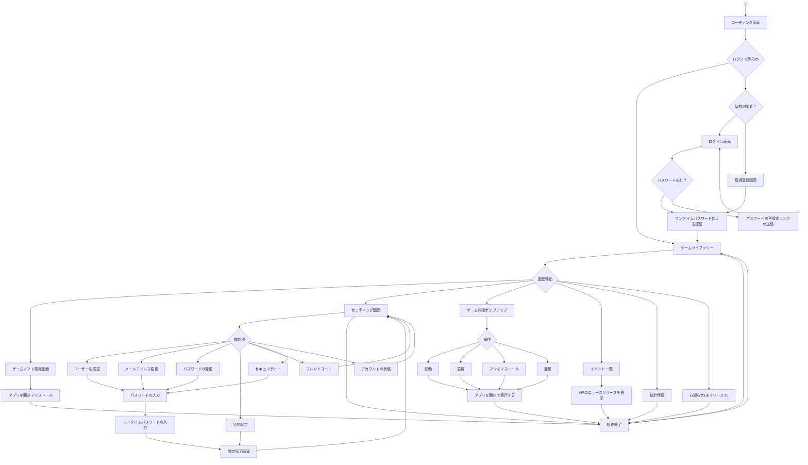

# Plan
## This is where you write down your plans
---
### First Plans

```mermaid
flowchart TD
    n1["Start"] --> n2["ローディング画面"]
    n2 --> n3["ログイン済みか"]
    n3 --> n4["ゲームライブラリー"] & n5["新規利用者？"]
    n5 --> n6["ログイン画面"] & n7["新規登録画面"]
    n6 --> n28["パスワード忘れ？"]
    n7 --> n8["ワンタイムパスワードによる認証"]
    n8 --> n4
    n4 --> n9["画面移動"] & n37["処理終了"]
    n9 --> n10["ゲームソフト販売画面"] & n11["セッティング画面"] & n12["ゲーム詳細ポップアップ"] & n13["イベント一覧"] & n14["統計情報"] & n15["お知らせ(未リリースで)"]
    n10 --> n16["アプリを開きインストール"]
    n11 --> n17["機能別"] & n37
    n17 --> n18["ユーザー名変更"] & n19["メールアドレス変更"] & n20["パスワードの変更"] & n21["公開設定"] & n22["フレンドコード"] & n23["セキュリティー"] & n24["アカウントの状態"]
    n18 --> n25["パスワードの入力"]
    n25 --> n26["ワンタイムパスワードの入力"]
    n19 --> n25
    n20 --> n25
    n23 --> n25
    n26 --> n27["設定完了画面"]
    n21 --> n27
    n27 --> n11
    n22 --> n11
    n24 --> n11
    n28 --> n8 & n29["パスワードの再設定リンクの送信"]
    n29 --> n6
    n13 --> n30["HPのニュースリリースを表示"]
    n12 --> n31["操作"]
    n31 --> n32["起動"] & n33["更新"] & n34["アンインストール"] & n35["変更"]
    n32 --> n36["アプリを開いて実行する"]
    n33 --> n36
    n34 --> n36
    n35 --> n36
    n36 --> n37
    n16 --> n37
    n14 --> n37
    n30 --> n37
    n15 --> n37
    n37 --> n4
    n1@{ shape: start}
    n2@{ shape: proc}
    n3@{ shape: decision}
    n4@{ shape: proc}
    n5@{ shape: decision}
    n6@{ shape: proc}
    n7@{ shape: proc}
    n28@{ shape: decision}
    n8@{ shape: proc}
    n9@{ shape: decision}
    n10@{ shape: proc}
    n11@{ shape: proc}
    n12@{ shape: proc}
    n17@{ shape: diam}
    n31@{ shape: decision}
```
